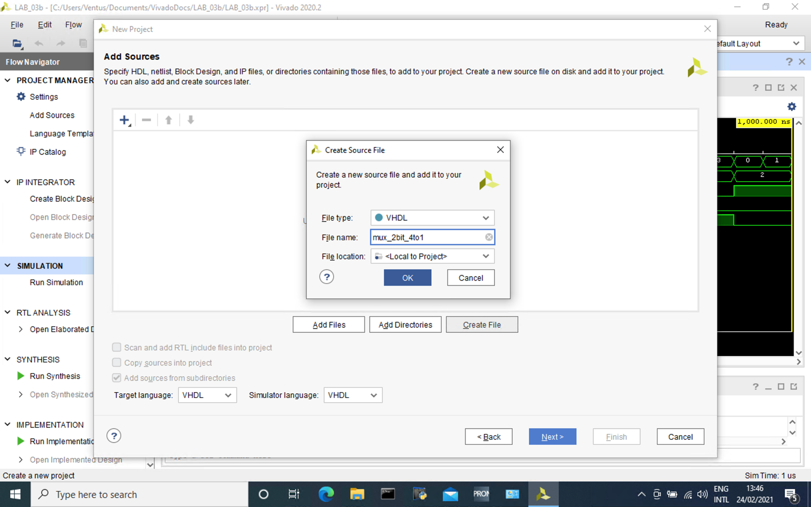

# BPC-DE1 Lab_03
:paperclip: Repository:
[Bobik77](https://github.com/Bobik77) 
/
[Digital-electronic-1](https://github.com/Bobik77/Digital-electronics-1) 
/
[LAB3](https://github.com/Bobik77/Digital-electronics-1/tree/main/LAB_03)
## Preparation tasks:
### Download and install Vivado
Done :white_check_mark:
### SW and LEDs connect table:


[Image source](https://reference.digilentinc.com/_media/reference/programmable-logic/nexys-a7/n4r.png?cache=) 
| Part | PIN |
| :--: | :--: |
| LED0 | H17 |
| LED1 | K15 |
| LED2 | J13 |
| LED3 | N14 |
| LED4 | R18 |
| LED5 | V17 |
| LED6 | U17 |
| LED7 | U16 |
| LED8 | V16 |
| LED9 | T15 |
| LED10 | U14 |
| LED11 | T16 |
| LED12 | V15 |
| LED13 | V14 |
| LED14 | V12 |
| LED15 | V11 |
| SW0 | J15 |
| SW1 | L16 |
| SW2 | M13 |
| SW3 | R15 |
| SW4 | R17 |
| SW5 | T18 |
| SW6 | U18 |
| SW7 | R13 |
| SW8 | T8 |
| SW9 | U8 |
| SW10 | R16 |
| SW11 | T13 |
| SW12 | H6 |
| SW13 | U12 |
| SW14 | U11 |
| SW15 | V10 |
## Two-bit wide 4-to-1 multiplexer
### Listing architecture
```vhdl
architecture Behavioral of mux_2bit_4to1 is
begin

    process (a_i, b_i, c_i, d_i, s_i)
    begin
        case s_i is
            when "00" => q_o <= a_i;
            when "01" => q_o <= b_i;
            when "10" => q_o <= c_i;
            when "11" => q_o <= d_i;
            when others => null;
        end case;
    end process;
    
end Behavioral;
```
### Listing testbench architecture
```vhdl
architecture testbench of tb_mux_2bit_4to1 is
    signal s_a      : std_logic_vector(1 downto 0);
    signal s_b      : std_logic_vector(1 downto 0);
    signal s_c      : std_logic_vector(1 downto 0);
    signal s_d      : std_logic_vector(1 downto 0);
    signal s_s      : std_logic_vector(1 downto 0);
    signal s_q      : std_logic_vector(1 downto 0);
begin
    --connecting testbench
    uut_mux_2bit_4to1   : entity work.mux_2bit_4to1
        port map(
            a_i     => s_a,
            b_i     => s_b,
            c_i     => s_c,
            d_i     => s_d,
            s_i     => s_s,
            q_o     => s_q
        );
     --Test signal generating
     p_stimuls : process
     begin
     --init. signal
        s_a <= "11";
        s_b <= "11";
        s_c <= "11";
        s_d <= "11";
     --1.st combination
        s_s <= "00";
            s_a <= "01";
            wait for 100 ns;
            s_a <= "10";
            wait for 100 ns;
            s_a <= "11";
     --2.nd combination
        s_s <= "01";
            s_b <= "01";
            wait for 100 ns;
            s_b <= "10";
            wait for 100 ns;
            s_b <= "11";
     --3.rd combination
        s_s <= "10";
            s_c <= "01";
            wait for 100 ns;
            s_c <= "10";
            wait for 100 ns;
            s_c <= "11";
     --4.th combination
        s_s <= "11";
            s_d <= "01";
            wait for 100 ns;
            s_d <= "10";
            wait for 100 ns;
        wait;
     end process p_stimuls;
end architecture testbench;
```
### Screenshot

Vstupní signály byly voleny tak, aby funkčnost multiplexoru byla zjevná.
## Vivado tutorial
### Project creation:
* Zadej cestu projektu a vyper RTl jako typ projektu
* Vytvoř soubor (*Create file*) a pojmenuj ho.  Tím se vytvoří *name*.vhd soubor kódu.



### Testbench:
* **File > Add Sources > Add or create simulation >Create file** vytvoříme *name*.vhd soubor testbenche. Zpravidla volíme název  jako *tb_name.vhd*

* Testbench vytvoříš běžným postupem jak ses naučil např. na EDA-Playground.
### Simulace:
*  Zvolením **Flow > Run Simulation > Run  Behavioral Simulation**  spustíme simulaci (projekt je prvně třeba uložit).
### Postprocesor:
* V postprocesoru vidíme průběhy jednotlivých  signálů
* Zvětšíme náhled na průběhy a zazoomujeme podle potřeby
* Jednotlivé sběrnice můžeme rozkliknout na signály,  můžeme je libovolně podbarvovat, měřit a vizualizovat
* V nastavení simulace je možné zvětšit délku trvání simulace

### Mapování vstupů:
* **File > Add Sources > Add or create constrains >Create file** vytvoříme *name*.xdc soubor mapování.
* Do souboru mapování vložím z předdefinovaného [souboru od výrobce](https://github.com/Digilent/digilent-xdc/blob/master/Nexys-A7-50T-Master.xdc)
* Odkomentuji ty prvky, které hodlám v programu použít
* Přepíši dané porty, tak aby odpovídali již napsané architektuře


