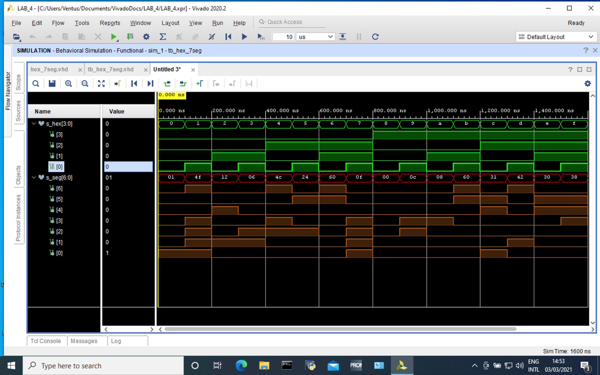
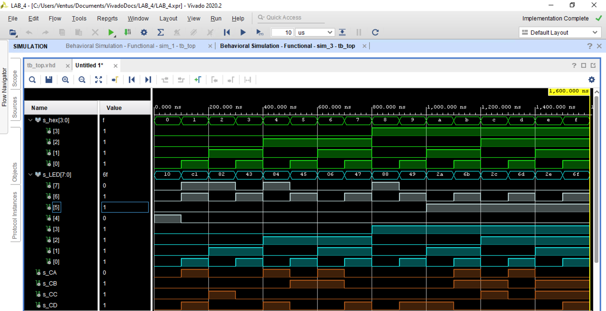

# BPC-DE1 Lab_04
:paperclip: Repository:
[Bobik77](https://github.com/Bobik77) 
/
[Digital-electronic-1](https://github.com/Bobik77/Digital-electronics-1) 
/
[LAB3](https://github.com/Bobik77/Digital-electronics-1/tree/main/LAB_04)
## 1. Preparation tasks:
### 1.1. 7-seg display connect table

[Image source](https://reference.digilentinc.com/_media/reference/programmable-logic/nexys-a7/n4r.png?cache=) 

### 1.2.Decoder truth table:
Light in HIGH >> Common anode (CA)

| **Hex** | **Input** | **A** | **B** | **C** | **D** | **E** | **F** | **G** |
| :-: | :-: | :-: | :-: | :-: | :-: | :-: | :-: | :-: |
| 0 | 0000 | 0 | 0 | 0 | 0 | 0 | 0 | 1 |
| 1 | 0001 | 1 | 0 | 0 | 1 | 1 | 1 | 1 |
| 2 | 0010 | 0 | 0 | 1 | 0 | 0 | 1 | 0 |
| 3 | 0011 | 0 | 0 | 0 | 0 | 1 | 1 | 0 |
| 4 | 0100 | 1 | 0 | 0 | 1 | 1 | 0 | 0 |
| 5 | 0101 | 0 | 1 | 0 | 0 | 1 | 0 | 0 |
| 6 | 0110 | 1 | 1 | 0 | 0 | 0 | 0 | 0 |
| 7 | 0111 | 0 | 0 | 0 | 1 | 1 | 1 | 1 |
| 8 | 1000 | 0 | 0 | 0 | 0 | 0 | 0 | 0 |
| 9 | 1001 | 0 | 0 | 0 | 1 | 1 | 0 | 0 |
| A | 1010 | 0 | 0 | 0 | 1 | 0 | 0 | 0 |
| b | 1011 | 1 | 1 | 0 | 0 | 0 | 0 | 0 |
| C | 1100 | 0 | 1 | 1 | 0 | 0 | 0 | 1 |
| d | 1101 | 1 | 0 | 0 | 0 | 0 | 1 | 0 |
| E | 1110 | 0 | 1 | 1 | 0 | 0 | 0 | 0 |
| F | 1111 | 0 | 1 | 1 | 1 | 0 | 0 | 0 |

## 2. Seven-segment display decoder
### 2.1 Architecture listing
```vhdl
architecture Behavioral of hex_7seg is
begin
    --------------------------------------------------------------------
    -- p_7seg_decoder:
    -- A combinational process for 7-segment display decoder. 
    -- Any time "hex_i" is changed, the process is "executed".
    -- Output pin seg_o(6) corresponds to segment A, seg_o(5) to B, etc.
    --------------------------------------------------------------------
    p_7seg_decoder : process(hex_i)begin
        case hex_i is
            when "0000" => seg_o <= "0000001";     -- 0
            when "0001" => seg_o <= "1001111";     -- 1
            when "0010" => seg_o <= "0010010";     -- 2
            when "0011" => seg_o <= "0000110";     -- 3
            when "0100" => seg_o <= "1001100";     -- 4
            when "0101" => seg_o <= "0100100";     -- 5
            when "0110" => seg_o <= "1100000";     -- 6
            when "0111" => seg_o <= "0001111";     -- 7
            when "1000" => seg_o <= "0000000";     -- 8
            when "1001" => seg_o <= "0001100";     -- 9
            when "1010" => seg_o <= "0001000";     -- A
            when "1011" => seg_o <= "1100000";     -- B
            when "1100" => seg_o <= "0110001";     -- C
            when "1101" => seg_o <= "1000010";     -- D
            when "1110" => seg_o <= "0110000";     -- E
            when "1111" => seg_o <= "0111000";     -- F
            when others => seg_o <= "0000000";     -- undefined
        end case;
    end process p_7seg_decoder;

end architecture Behavioral;
```
### 2.2. Testbench listing
```vhdl
architecture Behavioral of tb_hex_7seg is
signal s_hex    : std_logic_vector(3 downto 0);
signal s_seg    : std_logic_vector(6 downto 0);

begin
-- contect architecture to testbench
uut_hex_7seg    : entity work.hex_7seg 
    port map(
        hex_i => s_hex,
        seg_o => s_seg
        );
tb_stimuls: process begin
    -- complete truth table
    s_hex <= "0000";  wait for 100 ns ; -- 0
    s_hex <= "0001";  wait for 100 ns ; -- 1
    s_hex <= "0010";  wait for 100 ns ; -- 2
    s_hex <= "0011";  wait for 100 ns ; -- 3
    s_hex <= "0100";  wait for 100 ns ; -- 4
    s_hex <= "0101";  wait for 100 ns ; -- 5
    s_hex <= "0110";  wait for 100 ns ; -- 6
    s_hex <= "0111";  wait for 100 ns ; -- 7
    s_hex <= "1000";  wait for 100 ns ; -- 8
    s_hex <= "1001";  wait for 100 ns ; -- 9
    s_hex <= "1010";  wait for 100 ns ; -- a
    s_hex <= "1011";  wait for 100 ns ; -- b
    s_hex <= "1100";  wait for 100 ns ; -- c
    s_hex <= "1101";  wait for 100 ns ; -- d
    s_hex <= "1110";  wait for 100 ns ; -- e
    s_hex <= "1111";  wait for 100 ns ; -- f
    wait;
end process tb_stimuls;
end Behavioral;
```
### 2.3. Screenshots

### 2.4. Top level VHDL listing
```vhdl
entity top is
  Port (
  SW    : in std_logic_vector(4 - 1 downto 0); --data in
  LED   : out std_logic_vector(8 - 1 downto 0); --segment outs
  CA    : out std_logic;  -- cathode A
  CB    : out std_logic;  -- cathode B
  CC    : out std_logic;  -- cathode C
  CD    : out std_logic;  -- cathode D
  CE    : out std_logic;  -- cathode E
  CF    : out std_logic;  -- cathode F
  CG    : out std_logic;  -- cathode G
  AN    : out std_logic_vector(8 - 1 downto 0) -- common digits anodes
   );
end top;

------------------------------------------------------------------------
-- Architecture body for top level
------------------------------------------------------------------------
architecture behavioral of top is
begin

    --------------------------------------------------------------------
    -- Instance (copy) of hex_7seg entity
    hex2seg : entity work.hex_7seg
        port map(
            hex_i    => SW,
            seg_o(6) => CA,
            seg_o(5) => CB,
            seg_o(4) => CC,            
            seg_o(3) => CD,
            seg_o(2) => CE,
            seg_o(1) => CF,
            seg_o(0) => CG
        );

    -- Connect one common anode to 3.3V
    AN <= b"1111_0111";

    -- Display input value
    LED(3 downto 0) <= SW;

    -- Turn LED(4) on if input value is equal to 0, ie "0000"
    LED(4) <= '1' when (SW = "0000") else '0'; 
    
    -- Turn LED(5) on if input value is greater than 9
    LED(5) <= '1' when (SW >"1001") else '0';
    
    -- Turn LED(6) on if input value is odd, ie 1, 3, 5, ...
    LED(6) <= '1' when (SW(0) = '1') else '0'; -- compare LSB 
    
    -- Turn LED(7) on if input value is a power of two, ie 1, 2, 4, or 8
    LED(7) <= '1' when SW = "0001" else -- but 1 is not powerof two anyway
              '1' when SW = "0010" else
              '1' when SW = "0100" else
              '1' when SW = "1000" else
              '0';

end architecture behavioral;
```
## 3. LED(7:4) indicators
### 3.1. Truth table
| **Hex** | **Inputs** | **LED4** | **LED5** | **LED6** | **LED7** |
| :-: | :-: | :-: | :-: | :-: | :-: |
| 0 | 0000 | 1 | 0 | 0 | 0 |
| 1 | 0001 | 0 | 0 | 1 | 1 |
| 2 | 0010 | 0 | 0 | 0 | 1 |
| 3 | 0011 | 0 | 0 | 1 | 0 |
| 4 | 0100 | 0 | 0 | 0 | 1 |
| 5 | 0101 | 0 | 0 | 1 | 0 |
| 6 | 0110 | 0 | 0 | 0 | 0 |
| 7 | 0111 | 0 | 0 | 1 | 0 |
| 8 | 1000 | 0 | 0 | 0 | 1 |
| 9 | 1001 | 0 | 0 | 1 | 0 |
| A | 1010 | 0 | 1 | 0 | 0 |
| b | 1011 | 0 | 1 | 1 | 0 |
| C | 1100 | 0 | 1 | 0 | 0 |
| d | 1101 | 0 | 1 | 1 | 0 |
| E | 1110 | 0 | 1 | 0 | 0 |
| F | 1111 | 0 | 1 | 1 | 0 |
### LEDs function listing
```vhdl
 -- Connect one common anode to 3.3V
    AN <= b"1111_0111";

    -- Display input value
    LED(3 downto 0) <= SW;

    -- Turn LED(4) on if input value is equal to 0, ie "0000"
    LED(4) <= '1' when (SW = "0000") else '0'; 
    
    -- Turn LED(5) on if input value is greater than 9
    LED(5) <= '1' when (SW >"1001") else '0';
    
    -- Turn LED(6) on if input value is odd, ie 1, 3, 5, ...
    LED(6) <= SW(0); -- compare LSB 
    
    -- Turn LED(7) on if input value is a power of two, ie 1, 2, 4, or 8
    LED(7) <= '1' when SW = "0001" else -- but 1 is not powerof two anyway
              '1' when SW = "0010" else
              '1' when SW = "0100" else
              '1' when SW = "1000" else
              '0';
```
### 3.2. Screenshots

