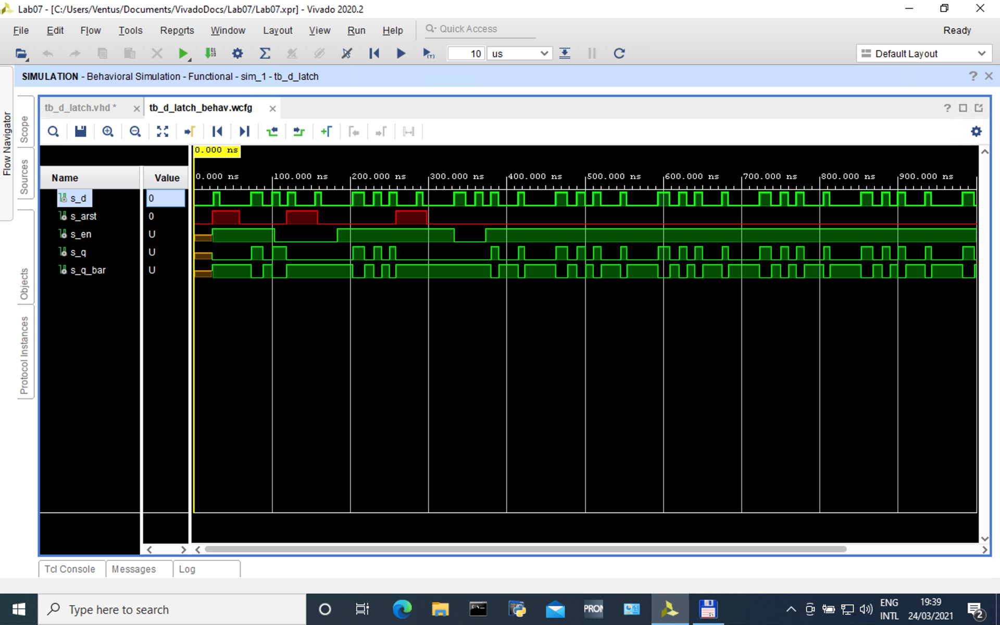
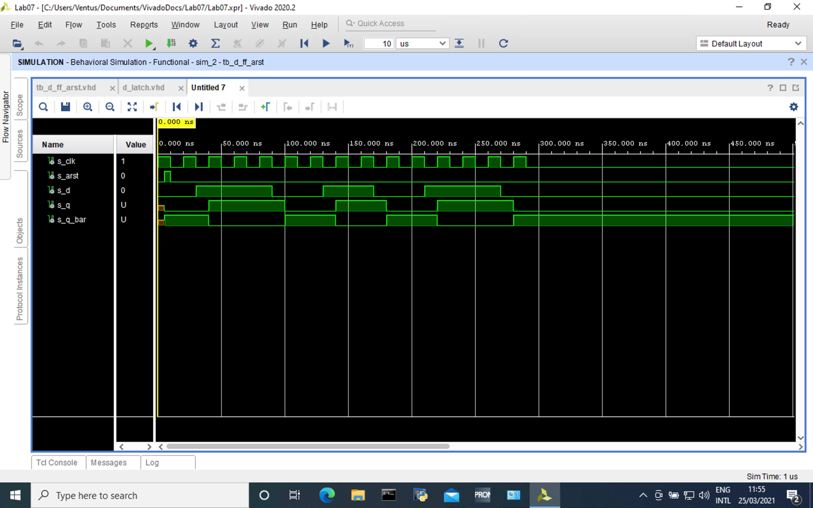
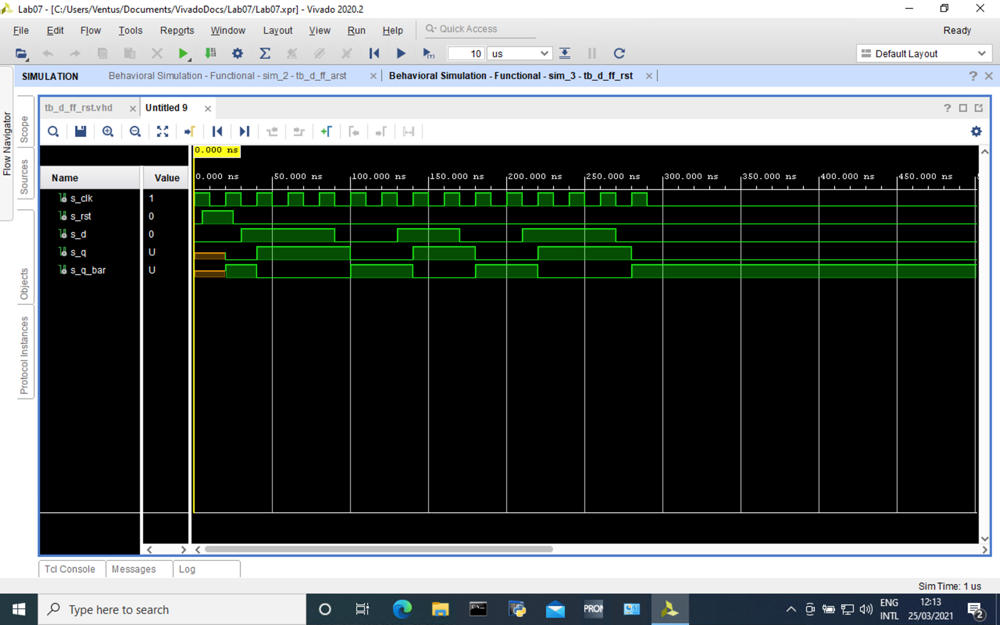
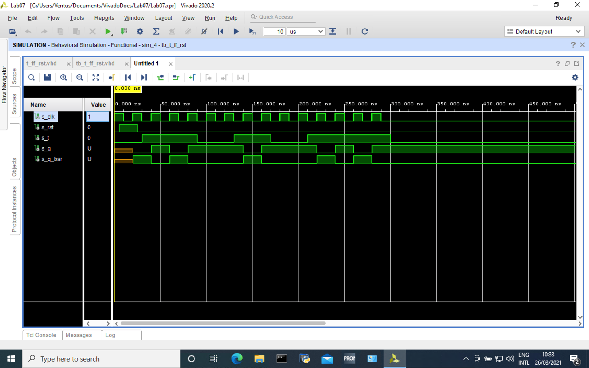
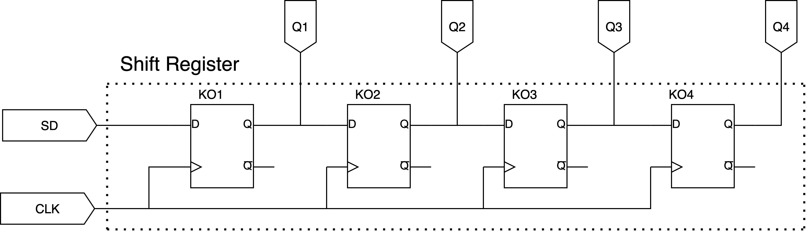

# BPC-DE1 Lab_07
:paperclip: Repository:
[Bobik77](https://github.com/Bobik77) 
/
[Digital-electronic-1](https://github.com/Bobik77/Digital-electronics-1) 
/
[LAB_07](https://github.com/Bobik77/Digital-electronics-1/tree/main/LAB_07)

## 1. Preparation task
### 1.1 D-type flip-flop
 Charakteristická rovnice: **Q(n+1) = D**
 
 | **D** | **Qn** | **Q(n+1)** | **Comments** |
   | :-: | :-: | :-: | :-- |
   | 0 | 0 | 0 | No change |
   | 0 | 1 | 0 | Reset |
   | 1 | 0 | 1 | Set |
   | 1 | 1 | 1 | No change |
   
### 1.2 JK-type flip-flop 
 Charakteristická rovnice: **Q(n+1) = J.!Q(n) + !K.Q(n)**
 
   | **J** | **K** | **Qn** | **Q(n+1)** | **Comments** |
   | :-: | :-: | :-: | :-: | :-- |
   | 0 | 0 | 0 | 0 | No change |
   | 0 | 0 | 1 | 1 | No change |
   | 0 | 1 | 0 | 0 | Reset|
   | 0 | 1 | 1 | 0 | Reset |
   | 1 | 0 | 0 | 1 | Set |
   | 1 | 0 | 1 | 1 | Set |
   | 1 | 1 | 0 | 1 | Inverse |
   | 1 | 1 | 1 | 0 | Inverse |
  
### 1.3 T-type flip-flop   
Charakteristická rovnice: **Q(n+1) = T.!Q(n) + !T.Q(n)**

   | **T** | **Qn** | **Q(n+1)** | **Comments** |
   | :-: | :-: | :-: | :-- |
   | 0 | 0 | 0 | No change |
   | 0 | 1 | 1 | No change |
   | 1 | 0 | 1 | Inverse |
   | 1 | 1 | 0 | Inverse |
   
## 2. D latch
### 2.1. Process p_d_latch listing
```vhdl
p_d_latch : process(en,d,arst)
begin   
  if (arst = '1') then
    q <= '0';
    q_bar <= '1';
  elsif (en = '1') then
    q <= d;
    q_bar <= not d;
  end if;
end process p_d_latch;
```
### 2.2. Reset and stimulus tb listing
```vhdl
--------------------------------------------------------------------
    -- Enable generation process
--------------------------------------------------------------------
p_en_gen : process
begin
   wait for 23ns;      
   s_en <= '1';
   wait for 80ns;
   s_en <= '0';
   wait for 80ns;
   s_en <= '1';
   wait for 150ns;
   s_en <= '0'; 
   wait for 40ns;
   s_en <= '1';
   wait;
end process p_en_gen;
-------------------------------------------------------
    -- Reset generation process
--------------------------------------------------------------------
tb_arst : process
begin
    s_arst <= '0';
    wait for 23 ns;
    s_arst <= '1';
    wait for 35 ns;
    s_arst <= '0';
    wait for 60 ns;
    s_arst <= '1';
    wait for 40 ns;
    s_arst <= '0';
    wait for 100 ns;
    s_arst <= '1';
    wait for 40 ns;
    s_arst <= '0';
    wait;
end process tb_arst;
--------------------------------------------------------------------
    -- Stimulus
--------------------------------------------------------------------
tb_stimulus : process
begin
    s_d <= '0';
    wait for 25 ns;
    s_d <= '1';
    wait for 8 ns;
    s_d <= '0';
    wait for 40 ns;
    s_d <= '1';
    wait for 15 ns;
    s_d <= '0';
    wait for 12 ns;
    s_d <= '1';
    wait for 10 ns;
    s_d <= '0';
    wait for 10 ns;
    s_d <= '1';
    wait for 10 ns;
end process tb_stimulus;
    
tb_check : process
begin
    wait for 23ns;
    assert (s_q = '0') and (s_q_bar = '1') --areset check (d HIGH)
      report "Reset fault" severity error;
    wait for 2ns;  
    assert (s_q = '0') and (s_q_bar = '1') --areset check (d LOW)
      report "Reset fault" severity error;
    wait for 308ns; 
    assert (s_q = '0') and (s_q_bar = '1') --enable hold on check
      report "Enable fault" severity error;
    wait for 47ns; 
    assert (s_q = '1') and (s_q_bar = '0') --transparency check
      report "Data fault" severity error;     
end process tb_check;
```
### 2.3 Screenshots


## 3. Flip-flops
### 3.1. Listing processes
#### 3.1.1 `d_ff_arst`
```vhdl
architecture Behavioral of d_ff_arst is
begin
    p_d_ff_arst: process(clk,arst)
    begin   
        if (arst = '1') then
        q <= '0';
        q_bar <= '1';
        elsif rising_edge(clk) then
        q <= d;
        q_bar <= not d;
        end if;
    end process p_d_ff_arst;
end Behavioral;

```
#### 3.1.2 `d_ff_rst`
```vhdl
p_d_ff_rst: process(clk)
begin   
    if rising_edge(clk) then
      if (rst = '1') then
        q <= '0';
        q_bar <= '1';
      else
        q <= d;
        q_bar <= not d;
      end if;
    end if;
end process p_d_ff_rst;
```
#### 3.1.3 `jk_ff_rst`
```vhdl
p_jk_ff_rst: process(clk)
variable q_local : std_logic;
begin   
    if rising_edge(clk) then -- rising edge sense
      if (rst = '1') then -- reset 
        q_local := '0';
      elsif ((j = '1')and(k = '1')) then --toogle
        q_local := not q_local;  
      elsif (j = '1') then -- "jump"
        q_local := '1';
      elsif (k = '1') then -- "kill"
        q_local := '0';
      end if;
      q <= q_local;       -- actualise output
      q_bar <= not q_local;   
    end if;
end process p_jk_ff_rst;
```
#### 3.1.4 `t_ff_rst`
```vhdl
p_t_ff_rst: process(clk)
variable q_local : std_logic;
begin   
    if rising_edge(clk) then -- rising edge sense
      if (rst = '1') then -- reset 
        q_local := '0';
      elsif (t = '1') then --toogle
        q_local := not q_local;  
      end if;
      q <= q_local;       -- actualise output
      q_bar <= not q_local;   
    end if;
end process p_t_ff_rst;
```


### 3.2. Test benches
#### 3.2.1 `d_ff_arst`
```vhdl
   -- Clock generation process            
    p_clk_gen: process
    begin
        while now < 300 ns loop
            s_clk <= '1';
            wait for 10ns;
            s_clk <= '0';
            wait for 10ns;
        end loop;
        wait;
    end process p_clk_gen;
    
    -- Init reset process
    p_reset: process
    begin
        s_arst <= '0';
        wait for 5 ns;
        s_arst <= '1';
        wait for 5 ns;
        s_arst <= '0';
        wait;
    end process p_reset;
    
    -- Stimul process
    p_stimulus: process
    begin
        s_d <= '0';
        wait for 30ns;
        s_d <= '1';
        wait for 60ns;
        s_d <= '0';
        wait for 40ns;
        s_d <= '1';
        wait for 40ns;
        s_d <= '0';
        wait for 40ns;
        s_d <= '1';
        wait for 60ns;
        s_d <= '0';
        wait;
    end process p_stimulus;
    
    -- Check process (asserts)
    p_check: process
    begin
        wait for 5 ns;
        assert (s_q='0')and(s_q_bar='1') -- reset check
            report "Reset fault" severity error;
        wait for 25 ns;
        assert (s_q='0')and(s_q_bar='1') -- Hold on check
            report "Hold fault" severity error;
        wait for 10 ns;
        assert (s_q='1')and(s_q_bar='1') -- reset check
            report "Set fault" severity error;
        wait;
    end process p_check;
        
```
#### 3.2.2 `d_ff_rst`
```vhdl
-- Clock generation process            
p_clk_gen: process
begin
    while now < 300 ns loop
        s_clk <= '1';
        wait for 10ns;
        s_clk <= '0';
        wait for 10ns;
    end loop;
    wait;
end process p_clk_gen;

-- Init reset process
p_reset: process
begin
    s_rst <= '0';
    wait for 5 ns;
    s_rst <= '1';
    wait for 20 ns;
    s_rst <= '0';
    wait;
end process p_reset;

-- Stimul process
p_stimulus: process
begin
    s_d <= '0';
    wait for 30ns;
    s_d <= '1';
    wait for 60ns;
    s_d <= '0';
    wait for 40ns;
    s_d <= '1';
    wait for 40ns;
    s_d <= '0';
    wait for 40ns;
    s_d <= '1';
    wait for 60ns;
    s_d <= '0';
    wait;
end process p_stimulus;

-- Check process (asserts)
p_check: process
begin
    wait for 20 ns;
    assert (s_q='0')and(s_q_bar='1') -- reset check
        report "Reset fault" severity error;
    wait for 10 ns;
    assert (s_q='0')and(s_q_bar='1') -- Hold on check
        report "Hold fault" severity error;
    wait for 10 ns;
    assert (s_q='1')and(s_q_bar='1') -- reset check
        report "Set fault" severity error;
    wait;
end process p_check;
```
#### 3.2.3 `jk_ff_rst`
```vhdl
p_clk_gen: process
begin
    while now < 300 ns loop
        s_clk <= '1';
        wait for 10ns;
        s_clk <= '0';
        wait for 10ns;
    end loop;
    wait;
end process p_clk_gen;

-- Init reset process
p_reset: process
begin
    s_rst <= '0';
    wait for 5 ns;
    s_rst <= '1';
    wait for 20 ns;
    s_rst <= '0';
    wait;
end process p_reset;

-- Stimul process
p_stimulus: process
begin
    s_j <= '0';
    s_k <= '0';
    wait for 30ns;
    s_j <= '1';
    wait for 60ns;
    s_j <= '0';
    wait for 40ns;
    s_k <= '1';
    wait for 40ns;
    s_k <= '0';
    wait for 40ns;
    s_j <= '1';
    s_k <= '1';
    wait for 90ns;
    s_j <= '0';
    s_k <= '0';
    wait;
end process p_stimulus;

-- Check process (asserts)
p_check: process
begin
    wait for 20 ns;
    assert (s_q ='0')and(s_q_bar='1') -- reset check
        report "Reset fault" severity error;
    wait for 20 ns;
    assert (s_q='1')and(s_q_bar='0') -- "jump" check
        report "Set to 1 fault" severity error;
    wait for 60 ns;
    assert (s_q='1')and(s_q_bar='1') -- Hold on check
        report "Hold fault" severity error;
    wait for 40 ns;
    assert (s_q='1')and(s_q_bar='1') -- "kill" check
        report "Set to 0 fault" severity error;
        wait for 80 ns;
    assert (s_q='1')and(s_q_bar='1') -- Toogle check
        report "Toogle fault" severity error;
    wait;
end process p_check;
```
#### 3.2.4 `t_ff_rst`
```vhdl
-- Clock generation process            
p_clk_gen: process
begin
    while now < 300 ns loop
        s_clk <= '1';
        wait for 10ns;
        s_clk <= '0';
        wait for 10ns;
    end loop;
    wait;
end process p_clk_gen;

-- Init reset process
p_reset: process
begin
    s_rst <= '0';
    wait for 5 ns;
    s_rst <= '1';
    wait for 20 ns;
    s_rst <= '0';
    wait;
end process p_reset;

-- Stimul process
p_stimulus: process
begin
    s_t <= '0';
    wait for 30ns;
    s_t <= '1';
    wait for 60ns;
    s_t <= '0';
    wait for 40ns;
    s_t <= '1';
    wait for 40ns;
    s_t <= '0';
    wait for 40ns;
    s_t <= '1';
    s_t <= '1';
    wait for 90ns;
    s_t <= '0';
    wait;
end process p_stimulus;

-- Check process (asserts)
p_check: process
begin
    wait for 20 ns;
    assert (s_q ='0')and(s_q_bar='1') -- reset check
        report "Reset fault" severity error;
    wait for 10 ns;
    assert (s_q='0')and(s_q_bar='1') -- hold off check
        report "Hold fault" severity error;
    wait for 10 ns;
    assert (s_q='1')and(s_q_bar='0') -- sync  check
        report "Sync fault" severity error;
    wait for 20 ns;
    assert (s_q='0')and(s_q_bar='1') -- toogle check
        report "Toogle fault" severity error;
    wait;
end process p_check;    
```

### 3.3. Screenshots
#### 3.3.1 `d_ff_arst`

#### 3.3.2 `d_ff_rst`

#### 3.3.3 `jk_ff_rst`

#### 3.3.4 `t_ff_rst`


## 4. Shift register scheme



