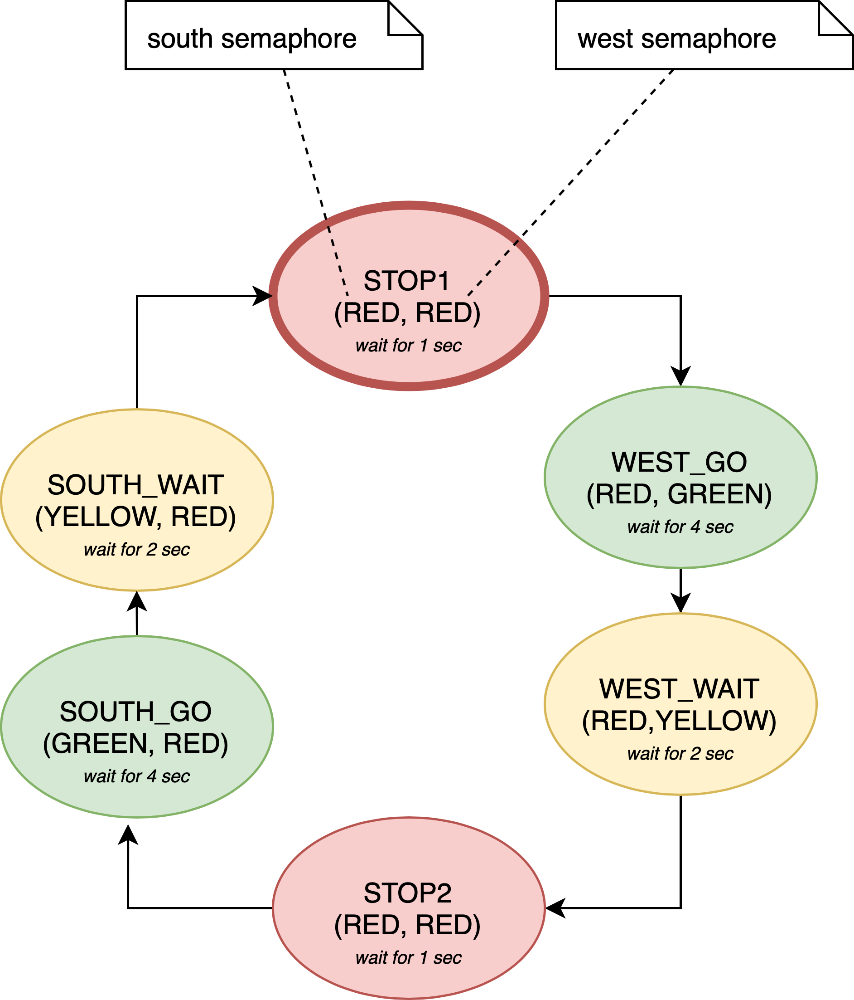
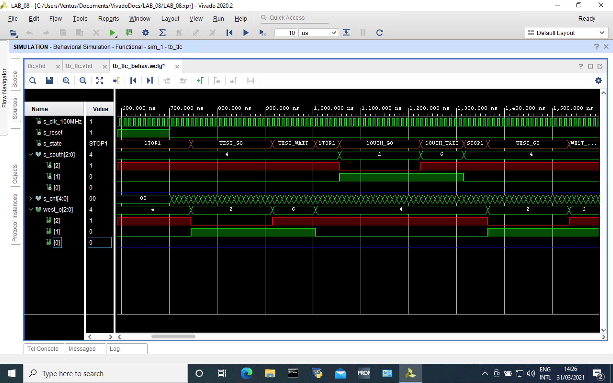
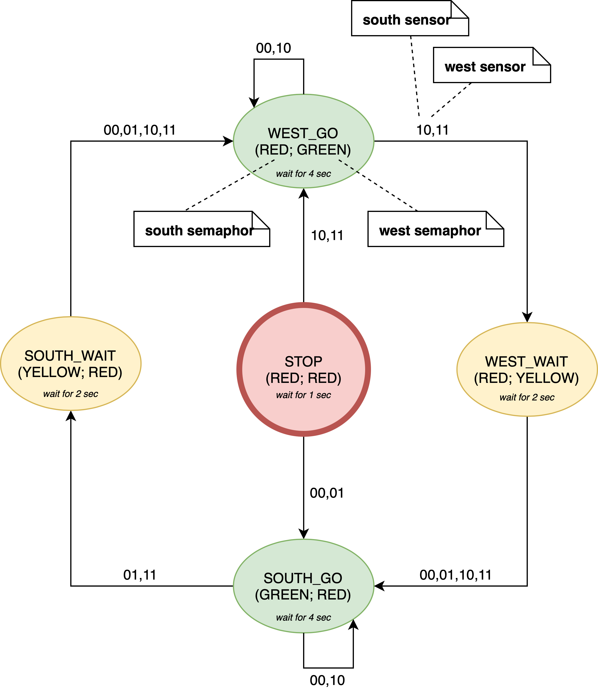

# BPC-DE1 Lab_08
:paperclip: Repository:
[Bobik77](https://github.com/Bobik77) 
/
[Digital-electronic-1](https://github.com/Bobik77/Digital-electronics-1) 
/
[LAB_08](https://github.com/Bobik77/Digital-electronics-1/tree/main/LAB_08)

## 1. Preparation task


| **Input P** | `0` | `0` | `1` | `1` | `0` | `1` | `0` | `1` | `1` | `1` | `1` | `0` | `0` | `1` | `1` | `1` |
| :-- | :-: | :-: | :-: | :-: | :-: | :-: | :-: | :-: | :-: | :-: | :-: | :-: | :-: | :-: | :-: | :-: |
| **Clock** |  |  |  |  |  |  |  |  |  |  |  |  |  |  |  |  |
| **State** | A | A | B | C | C | D | A | B | C | D | B | B | B | C | D | B |
| **Output R** | `0` | `0` | `0` | `0` | `0` | `1` | `0` | `0` | `0` | `1` | `0` | `0` | `0` | `0` | `1` | `0` |

 
| **RGB LED** | **Artix-7 pin names** | **Red** | **Yellow** | **Green** |
| :-: | :-: | :-: | :-: | :-: |
| LD16 | N15, M16, R12 | `1,0,0` | `1,1,0` | `0,1,0` |
| LD17 | N16, R11, G14 | `1,0,0` | `1,1,0` | `0,1,0` |

## 2. Traffic light controller
### 2.1. FSM State Diagram

### 2.2. VHDL sequential process listing
```vhdl
p_traffic_fsm : process(clk)
begin
    if rising_edge(clk) then
        if (reset = '1') then       -- Synchronous reset
            s_state <= STOP1 ;      -- Set initial state
            s_cnt   <= c_ZERO;      -- Clear all bits

        elsif (s_en = '1') then
            -- Every 250 ms, CASE checks the value of the s_state 
            -- variable and changes to the next state according 
            -- to the delay value.
            case s_state is

                -- If the current state is STOP1, then wait 1 sec
                -- and move to the next GO_WAIT state.
                when STOP1 =>
                    -- Count up to c_DELAY_1SEC
                    if (s_cnt < c_DELAY_1SEC) then
                        s_cnt <= s_cnt + 1;
                    else
                        -- Move to the next state
                        s_state <= WEST_GO;
                        -- Reset local counter value
                        s_cnt   <= c_ZERO;
                    end if;

                when WEST_GO =>
                    -- Count up to c_DELAY_4SEC
                    if (s_cnt < c_DELAY_4SEC) then
                        s_cnt <= s_cnt + 1;
                    else
                        s_state <= WEST_WAIT; -- move to next state
                        s_cnt <= c_ZERO; -- reset counter
                    end if; 
                    
                when WEST_WAIT =>
                    -- Count up to c_DELAY_2SEC
                    if (s_cnt < c_DELAY_2SEC) then
                        s_cnt <= s_cnt + 1;
                    else
                        s_state <= STOP2; -- move to next state
                        s_cnt <= c_ZERO; -- reset counter
                    end if; 
                    
                when STOP2 =>
                    -- Count up to c_DELAY_1SEC
                    if (s_cnt < c_DELAY_1SEC) then
                        s_cnt <= s_cnt + 1;
                    else
                        s_state <= SOUTH_GO; -- move to next state
                        s_cnt <= c_ZERO; -- reset counter
                    end if; 
                    
                when SOUTH_GO =>
                    -- Count up to c_DELAY_4SEC
                    if (s_cnt < c_DELAY_4SEC) then
                        s_cnt <= s_cnt + 1;
                    else
                        s_state <= SOUTH_WAIT; -- move to next state
                        s_cnt <= c_ZERO; -- reset counter
                    end if;
                    
                when SOUTH_WAIT =>
                    -- Count up to c_DELAY_2SEC
                    if (s_cnt < c_DELAY_2SEC) then
                        s_cnt <= s_cnt + 1;
                    else
                        s_state <= STOP1; -- move to next state
                        s_cnt <= c_ZERO; -- reset counter
                    end if; 
                -- treatment of undeclared conditions
                when others =>
                    s_state <= STOP1;

            end case;
        end if; -- Synchronous reset
    end if; -- Rising edge
end process p_traffic_fsm;
```
### 2.3. VHDL combinatorial process listing
```vhdl
p_output_fsm : process(s_state)
begin
    case s_state is
        when STOP1 =>
            south_o <= "100";   -- Red (RGB = 100)
            west_o  <= "100";   -- Red (RGB = 100)
        when WEST_GO =>
            south_o <= "100";   -- Red (RGB = 100)
            west_o  <= "010";   -- GREEN (RGB = 010)
        when WEST_WAIT =>
             south_o <= "100";   -- RED (RGB = 100)
             west_o  <= "110";   -- YELLOW (RGB = 110)
        when STOP2 =>
            south_o <= "100";   -- Red (RGB = 100)
            west_o  <= "100";   -- Red (RGB = 100)
        when SOUTH_GO => 
            south_o <= "010";   -- GREEN (RGB = 010)
            west_o  <= "100";   -- Red (RGB = 100)
        when SOUTH_WAIT =>
            south_o <= "110";   -- YELLOW (RGB = 110)
            west_o  <= "100";   -- Red (RGB = 100)
        when others =>
            south_o <= "100";   -- Red
            west_o  <= "100";   -- Red
    end case;
end process p_output_fsm;
```
### 2.4. Screenshots
 


## 3. Smart controller
### 3.1 State table
| **Actual State** | **Output west** | **Output south** | **No cars** | **Cars on west** | **Cars on south** | **Boot direction cars** |
| :-: | :-: | :-: | :-: | :-: | :-: | :-: |
| SOUTH_GO | `RED` | `GREEN` | SOUTH_GO | SOUTH_WAIT | SOUTH_GO | SOUTH_WAIT |
| SOUTH_WAIT| `RED` | `YELLOW` | SOUTH_WAIT | SOUTH_WAIT | SOUTH_WAIT | SOUTH_WAIT |
| WEST_GO | `GREEN` | `RED` | WEST_GO | WEST_GO |  WEST_WAIT | WEST_WAIT |
| WEST_WAIT | `YELLOW` | `RED` | WEST_WAIT | WEST_WAIT | WEST_WAIT | WEST_WAIT |

### 3.2 State diagram

### 3.3 VHDL sequential process listing
```vhdl
p_smart_traffic_fsm : process(clk)
begin
    if rising_edge(clk) then
        if (reset = '1') then       -- Synchronous reset
            s_state <= STOP;      -- Set initial state
            s_cnt   <= c_ZERO;      -- Clear all bits

        elsif (s_en = '1') then
            case s_state is
                -- init state
                when STOP =>
                    -- Count up to c_DELAY_1SEC
                    if (s_cnt < c_DELAY_1SEC) then
                        s_cnt <= s_cnt + 1;
                    -- set first direction taking into account to actual cars
                    elsif (west_sens_i = '1') then
                        s_state <= WEST_GO;
                        s_cnt   <= c_ZERO;
                    else 
                        s_state <= SOUTH_GO;
                        s_cnt   <= c_ZERO;
                    end if;

                when WEST_GO =>
                    -- Count up to c_DELAY_4SEC
                    if (s_cnt < c_DELAY_4SEC) then --stay in SOUTH_GO for min 4sec
                        s_cnt <= s_cnt + 1;
                    elsif (south_sens_i = '1') then
                    --toogle directions only by sensing for cars in south
                        s_state <= WEST_WAIT; -- change state
                        s_cnt <= c_ZERO; -- reset counter
                    end if; 
                    
                when SOUTH_GO =>
                    -- Count up to c_DELAY_4SEC
                    if (s_cnt < c_DELAY_4SEC) then --stay in SOUTH_GO for min 4sec
                        s_cnt <= s_cnt + 1;
                    elsif (west_sens_i = '1') then 
                    --toogle directions only by sensing cars in west
                        s_state <= SOUTH_WAIT; -- change state
                        s_cnt <= c_ZERO; -- reset counter
                    end if;
                       
                 when WEST_WAIT =>
                    -- Count up to c_DELAY_2SEC
                    if (s_cnt < c_DELAY_2SEC) then
                        s_cnt <= s_cnt + 1;
                    else
                        s_state <= SOUTH_GO; -- switch to south 
                        s_cnt <= c_ZERO; -- reset counter
                    end if;  
                        
                when SOUTH_WAIT =>
                    -- Count up to c_DELAY_2SEC
                    if (s_cnt < c_DELAY_2SEC) then
                        s_cnt <= s_cnt + 1;
                    else
                        s_state <= WEST_GO; -- switch to west
                        s_cnt <= c_ZERO; -- reset counter
                    end if; 
                -- treatment of undeclared conditions
                when others =>
                    s_state <= STOP;

            end case;
        end if; -- Synchronous reset
    end if; -- Rising edge
end process p_smart_traffic_fsm;
```