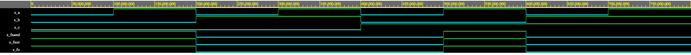
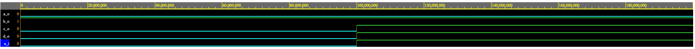
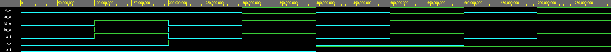

# Digital-electronics-1
**Name:** Vaněk Pavel,
**ID:** 221072,
## Emphasis example:
**bold**,
*italic*,
***bold/italic***,
## Lists examples:
### Ordered
1. Základy digitálních obvodů a kombinační logiky
2. Principy sekvenčních obvodů a konečných automatů
3. Psaní kódu ve VHDL
4. Navrhování testbench ve VHDL
5. Navrhování obvodů pro FPGA
### Unordered
* DE1
    * Bool algebra
    * VHDL
    * ...
* AE1
* AUD
## Link example:
[This repository](https://github.com/Bobik77/Digital-electronics-1) was made for usage of  Lecture BPC-DE1;  BUT 2021.
## Table example
 | Col1  | Col2 |
 | :--: | :--: |
 | Row2 |  Row2 |
 | Row3 |  Row3 |
 | Row4 |  Row4 |
 ## Code example in VHDL:
```vhdl
signal input_stream : input; signal clk :std_logic; signal parity :bit ;
begin
U1: Parity_Generator1 port map(
input_stream, clk,
input1 : process (clk)
parity => parity );
begin
if clk <= 'U' then clk <= '0' after 1 ns; else clk <= not clk after 1 ns;
end if;
end process;
```
# Programming:
## De Morgan's law verification
### Code of architecture
```vhdl
architecture dataflow of gates is
begin
	-- original  function:
    fo_o    <= ((not b_i) and a_i) or ((not c_i) and (not b_i));
    -- modified function with NORs only:
    fnor_o  <= ((b_i nor (a_i nor a_i)) nor (c_i nor b_i)) nor ((b_i nor (a_i nor a_i)) nor (c_i nor b_i));
    -- modified function with NANDs only:
    fnand_o <= ((b_i nand b_i) nand a_i) nand ((c_i nand c_i) nand (b_i nand b_i));

end architecture dataflow;
```
### Waveforms

### Playground link
Here is link my playground link to my play [playground program site](https://www.edaplayground.com/x/A8MC).
(https://www.edaplayground.com/x/A8MC)


## Distributive laws verification 1 
### Code of architecture
```vhdl
architecture dataflow of gates is
begin
	a_o <= x_i and (not x_i);
    b_o <= x_i or (not x_i);
    c_o <= x_i or x_i or x_i;
    d_o <= x_i and x_i and x_i;

end architecture dataflow;
```
### Waveforms

### Playground link
Here is link my playground link to my play [playground program site](https://www.edaplayground.com/x/jLYU).
(https://www.edaplayground.com/x/jLYU)


## Distributive laws verification 2 
### Code of architecture
```vhdl
architecture dataflow of gates is
begin
	-- Equation A
	-- left side:
    aL_o    <=  (x_i and y_i) or (x_i and z_i);
    -- right side:
    aR_o    <=  x_i and (y_i or z_i);
    
    -- Equation B
	-- left side:
    bL_o    <= (x_i or y_i) and (x_i or z_i);
    -- right side:
    bR_o    <= x_i or (y_i and z_i);

end architecture dataflow;
```
### Waveforms

Je zřejmé že rovnice platí. Provedli jsme jednoduchou zkoušku - pravá strana se rovná levé.
### Playground link
Here is link my playground link to my play [playground program site](https://www.edaplayground.com/x/m_y5).
(https://www.edaplayground.com/x/m_y5)